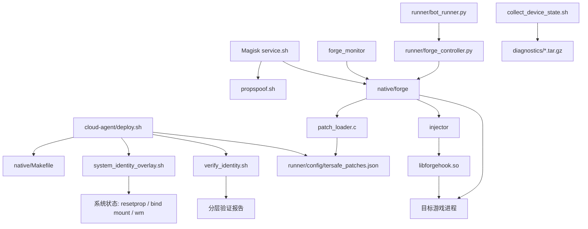

# DeltaForge 8.7 代码知识图谱

> 用途：先按图谱定位修改面，再读取具体实现。每次代码、配置、部署路径或云机证据变化后同步更新本文件。
>
> 网络图谱：`NETWORK_KNOWLEDGE.md`。

## 1. 当前基线

| 项 | 当前真值 |
|---|---|
| 产品版本 | `8.7` |
| 目标包名 | `com.tencent.tmgp.dfm` |
| 设备画像 | Samsung `SM-G9730` / `beyond1q` |
| OS 画像 | Android 11 / SDK 30 / user / release-keys |
| SoC/GPU 画像 | Snapdragon 855 (`SM8150`, `msmnile`) / Adreno 640 |
| TerSafe Build ID | `d70d7926094ae39a46745c12ddcc1877641f82e8` |
| UE4 Build ID | `8187ddb9edbc9d5201201ffd7b008df3bfe533db` |
| 代码表 | 58 条预检代码项，全部要求 `expected` |
| BSS 表 | 40 条，当前只有地址边界校验 |
| UE4 表 | 0 条，旧 6 个 RVA 已隔离 |
| 显示画像 | `1080x2280 @ 420dpi` |

`collector-r2`、`diagnostics-v2` 中的 `r2/v2` 是采集器迭代号，不是产品版本。
历史文档中的 `v8.8.x` 是旧提交标签，只用于追溯；当前运行时、部署脚本和配置统一声明 `8.7`。

## 2. 组件图



## 3. 节点职责

| 节点 | 入口/真源 | 负责内容 | 不负责内容 |
|---|---|---|---|
| 部署 | `cloud-agent/deploy.sh` | 编译、复制 native 产物、JSON、overlay、验证脚本，写 `v8.7` 版本戳 | 不证明游戏 namespace 已看到 overlay |
| 系统 overlay | `cloud-agent/system_identity_overlay.sh` | Root 下 resetprop、只读 bind `/proc`/DT（含 osrelease/compatible）、显示覆盖，支持快照回滚 | 不改变真实内核、CPU 指令、GPU 驱动 |
| Magisk 属性 | `cloud-agent/magisk/system/bin/propspoof.sh` | 启动阶段属性画像 | 不覆盖直接读取内核/驱动的路径 |
| 主控 | `cloud-agent/native/forge.c` | 准备、启动、Build ID 校验、内存写入、注入、IPC | 不替换宿主内核或容器 namespace |
| 偏移加载 | `patch_loader.c/.h` | 无依赖 JSON 解析 | 不决定 Build ID 是否匹配运行目标 |
| 偏移真源 | `runner/config/tersafe_patches.json` | Build ID、58 条预检代码项、40 条 BSS、可选 UE4 项 | 不允许缺失 `expected` 的代码项 |
| 进程 Hook | `cloud-agent/native/libforgehook.c` | QIMEI chainload；属性、文件、maps、uname、GPU、网络接口、传感器等用户态读取路径 | 不写 TerSafe/UE4 代码；不覆盖 inline `SVC`、真实内核/驱动行为、进程外读取 |
| 注入器 | `cloud-agent/native/injector.c` | ptrace 附加全部线程并只执行 `dlopen` Hook 库 | 不持有偏移表，不写目标模块代码，不提供系统级覆盖 |
| 监控器 | `cloud-agent/native/forge_monitor.c` | 运行状态和告警 IPC | 不应维护另一套硬编码 patch 真源 |
| 控制器 | `runner/forge_controller.py` | SipHash 认证协议和命令调用 | 不直接修改目标进程 |
| 自动化 | `runner/bot_runner.py` | 读取嵌套配置、创建控制器、编排操作 | 不拥有 native 偏移真源 |
| 采集器 | `cloud-agent/collect_device_state.sh` | 只读采集云机证据并打包 | `r2/v2` 不参与产品版本统一 |
| 验证器 | `cloud-agent/verify_identity.sh` | 属性、内核节点、mount、SELinux、KGSL、Hook、Seccomp 分层检查 | WARN 不等价于覆盖成功 |

## 4. 关键数据流

### 启动与写入

`deploy.sh` -> `/data/local/tmp/*` -> `forge -l` -> `load_dyn_table()` -> 等待目标模块 ->
读取磁盘 ELF Build ID -> 逐条核对 `expected` -> 写入 -> `injector` -> `libforgehook.so`。

写入不变量：

1. JSON 必须存在且解析成功。
2. `build_id` 必须存在并与磁盘 `libtersafe.so` 一致。
3. TerSafe 必须正好 58 条，BSS 必须正好 40 条。
4. 每条 TerSafe/UE4 代码项必须带 `expected`。
5. 非空 UE4 表必须携带并匹配独立的 `ue4_build_id`。
6. 首次写入、维护回写、快速链和 IPC 紧急回写都调用 `safe_verify_and_write()`。
7. 可执行文件内的旧静态表位于 `#if 0`，不参与编译和回退。
8. UE4 当前为空；完成当前 Build ID 的重新定位前保持隔离。
9. `forge.c` 是唯一目标模块写入所有者；`injector.c` 与 `libforgehook.c` 的活动代码无硬编码 patch 表或指令写入。
10. 默认启动不设置 `wrap.PKG`：游戏启动后先完成 validated write，再由 injector `dlopen` Hook；旧 wrap 属性在 prepare 阶段清除。
11. BSS 只写 JSON 中的 40 个显式地址；不扫描或猜测低值计数器。
12. 写入前先完整预检 58 个代码点和 40 个 BSS 地址；任一预检/写入失败即取消 Hook 注入并停止该次游戏启动，不进入部分生效状态。
13. 部署编译前先复制已有 native 产物；`--dry-run` 不写 `/data/local/tmp`，部署元数据只在旧版本备份完成后更新。
14. injector 成功 `dlopen` 后远程 `munmap` 8 KiB 调用区，并在所有错误路径 detach 全部已附加线程；清理失败视为启动失败。

运行时证据（2026-07-29）：`0x5137C0`、`0x516640`、`0x526ED0` 在相同
Build ID 的不同 ASLR 启动中读到的 32 位值发生变化，属于动态/重定位槽，已从
稳定代码表隔离；禁止把单次启动采样值写入 `expected`。

同日 `--code-only` 隔离试验证明：无 Hook、无 BSS 写入时，旧 72 项代码表仍使
TerSafe 在 `+0x1e70c0` 附近形成重复栈并退出。历史新增的 14 项 `kKillChain`
把 tombstone 返回地址误当函数入口，将 `BL`、`BLR`、`LDR` 或条件分支直接改成
`RET`，会在函数中部绕过栈帧恢复。它们已从活动表隔离；后续只有经过函数边界、
控制流和调用约定验证的替代项才能重新加入。

故障隔离入口：`forge -m --code-only` 只执行 58 项代码表，
`forge -m --bss-only` 只执行 40 项 BSS 表。两者仅允许与 `-m` 组合，默认
`forge -m`/`forge -l` 仍执行完整事务；诊断模式不得作为正式启动路径。

### 身份读取

`resetprop` 提供全局 Android 属性；只读 bind 提供当前 mount namespace 的 `/proc`/DT 文本；
`libforgehook.so` 只在游戏进程内覆盖 libc/JNI/图形接口读取。三条路径必须返回同一画像。
`ro.product.{odm,product,system,system_ext,vendor}.*` 与基础 `ro.product.*` 使用同一画像。

### 回滚

`system_identity_overlay.sh apply` 首次保存属性、显示参数；`rollback` 卸载 bind、恢复显示、恢复或删除原属性。
原始 `/proc`、sysfs 和设备树节点不被写入。

## 5. 修改联动矩阵

| 修改目标 | 必查/必改文件 |
|---|---|
| 产品版本 | `Makefile` 宏、`deploy.sh` 版本戳、Magisk `module.prop`、运行日志、README/指南；不改采集器 r2/v2 |
| 设备/SoC/GPU 画像 | `system_identity_overlay.sh`、`propspoof.sh`、`libforgehook.c`、`forge.c`、`forge_config.json`、`verify_identity.sh`、相关文档 |
| TerSafe 版本/偏移 | `tersafe_patches.json`、Build ID 常量、表数量断言、测试；先采集原 opcode |
| UE4 RVA | 先确认 UE4 Build ID，再填 `expected`；禁止恢复旧 6 项 |
| IPC 协议 | `forge.c` wire body/MAC 与 `forge_controller.py` 必须成对修改，并运行协议测试 |
| 部署路径 | `deploy.sh`、Magisk `service.sh`、操作指南、验证脚本 |
| Hook 文件接口 | `open/fopen/access/stat/lstat/fstatat/statx/faccessat2` 行为必须一致 |
| constructor 顺序 | `libforgehook.c` 合法优先级区间：101/102/103/104 -> 150 -> 170 -> 200 |
| 内存写入所有权 | 只修改 `forge.c` + `patch_loader.c/.h` + `tersafe_patches.json`；`injector.c`/`libforgehook.c` 不新增偏移表或目标代码写入 |

## 6. 云机证据

collector-r2 已确认的宿主事实：

- Rockchip RK3588S / AntDock / Cortex-A55+A76。
- LXC/overlay mount 痕迹。
- SELinux disabled。
- `/system/xbin/s9su`、`script_guard`、Rockchip vendor service。
- 缺少真实 Qualcomm KGSL 和 `soc0` 节点。
- 物理显示 720x1280；逻辑覆盖设置为 1080x2280。
- 游戏进程 `Seccomp: 0`，inline `SVC` 可绕过 libc Hook。

尚待云机复测：

- Root 执行的 bind 是否传播到游戏 mount namespace。
- 58 个代码项的 `expected` 在干净冷启动映射上是否全部匹配。
- GLES/EGL/Vulkan 导出符号是否被目标实际调用。
- 属性回滚、显示回滚、bind 回滚是否完整。

## 7. 层级与检测面

| 层 | 当前实现 | 检测面 |
|---|---|---|
| Root 权限层 | 部署、resetprop、mount、ptrace | Root 工具路径、UID/进程、策略状态仍可暴露 |
| 系统状态层 | 属性、bind、wm | 只在获得该状态/namespace 的读取者可见 |
| 游戏进程层 | `libforgehook.so` 用户态 Hook | direct syscall、完整性扫描、进程外采集可绕过 |
| 宿主内核/驱动层 | 未替换 | CPU 行为、KGSL、SELinux、容器拓扑仍是真实宿主 |

因此当前是 Root 驱动的混合覆盖，不是把云机底层整体变成真机。检测风险仍存在，优先级为：
宿主镜像/内核事实 > mount namespace 传播 > direct syscall > 进程内一致性。

## 8. 验证入口

本地/CI：

```bash
python -m unittest discover -s tests -v
python -m py_compile runner/forge_controller.py runner/bot_runner.py
bash -n cloud-agent/deploy.sh cloud-agent/system_identity_overlay.sh cloud-agent/verify_identity.sh
```

云机：

```bash
su -c /data/local/tmp/system_identity_overlay.sh apply
su -c /data/local/tmp/forge -l
su -c /data/local/tmp/verify_identity.sh
su -c /data/local/tmp/system_identity_overlay.sh status
```

回滚：

```bash
su -c /data/local/tmp/system_identity_overlay.sh rollback
```

## 9. 图谱维护规则

1. 改代码前先查“修改联动矩阵”和对应节点，只读必要文件。
2. 新增入口、配置真源、跨模块协议或部署路径时，必须新增节点与边。
3. 云机采集结论分为“已确认”和“待复测”，不以设计推断替代证据。
4. 版本号只描述产品基线；诊断采集器使用独立 `rN` 标识。
5. 文件行号易漂移，图谱优先记录函数名、配置键和命令入口。

## 10. v8.7 云机部署与 namespace 收口

- `deploy.sh` 在 Termux UID 下只编译和生成 Root 子脚本；`/data/local/tmp` 的旧文件备份、覆盖、校验和与 `forge.version` 写入全部在 `su` 子脚本中完成。
- `system_identity_overlay.sh apply` 维护 Root 调用方视图；`apply-pid PID` 通过 `nsenter` 进入游戏 mount namespace，再执行内部入口 `apply-local PID`。
- `apply-local` 只挂载只读 `/proc`、Device Tree 和 `/sys/fs/selinux/enforce` 画像，不重复修改全局属性与显示参数；每个 PID 使用 `mounts.pid.PID.state` 记录。
- `forge.c::do_launch()` 的固定顺序为：启动并取得 PID -> `apply_identity_namespace(pid)` -> JSON 全表预检/写入 -> injector `dlopen`。
- `/sys/fs/selinux/enforce=1` 只是读取节点 overlay。真实策略行为继续由 `getenforce`、策略加载状态和内核 AVC 行为判定，不能由该节点推导。
- `verify_identity.sh::ns_cat()` 在游戏 namespace 分别核对 `cpuinfo`、`osrelease`、Device Tree `compatible` 与 SELinux 读取节点；真实 `uname`、KGSL、SELinux 行为、Root 路径及容器拓扑继续单列。
- 云机再次部署后，应先确认出现 `Previous version backed up`、`Deploy done` 和 `v8.7 deploy complete`，再运行 `forge -l` 与验证脚本。checksum 后直接返回提示符表示 Root 部署事务尚未开始或已失败。
